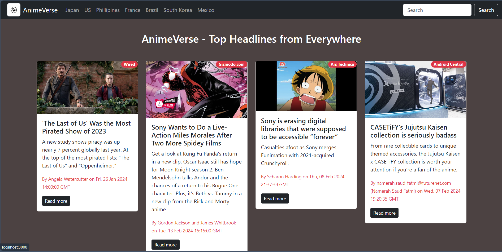

# AnimeVerse - Anime News Fetcher

## Overview



AnimeVerse is a React application that fetches the latest trending news about Animes using the News API. Stay updated with the latest information and trends in the world of Anime right from your browser.

## Installation

To run AnimeVerse locally, follow these steps:

1. Clone the repository to your local machine:

   ```bash
   git clone https://github.com/theanshumansinha/AnimeVerse.git
   ```

2. Navigate to the project directory:

   ```bash
   cd AnimeVerse
   ```

3. Install dependencies using npm:

   ```bash
   npm install
   ```

## Usage

Once the installation is complete, you can start the application using:

```bash
npm start
```

This will launch the application on `localhost:3000`. Open your web browser and navigate to [http://localhost:3000](http://localhost:3000) to view AnimeVerse in action.

## Features

- **Latest Anime News:** Stay informed about the latest news and trends in the world of Anime.
- **User-friendly Interface:** AnimeVerse provides a clean and intuitive user interface for a seamless experience.
- **Responsive Design:** The application is designed to be responsive, ensuring a consistent experience across various devices.

## Technologies Used

- React
- News API

## License

This project is licensed under the MIT License - see the [anshumansinha](LICENSE) file for details.

## Acknowledgments

- Special thanks to the [News API](https://newsapi.org/) for providing the latest Anime news data.

Feel free to explore, contribute, and enjoy AnimeVerse! If you encounter any issues or have suggestions, please open an [issue](https://github.com/your-username/AnimeVerse/issues) or create a [pull request](https://github.com/theanshumansinha/AnimeVerse/pulls).
